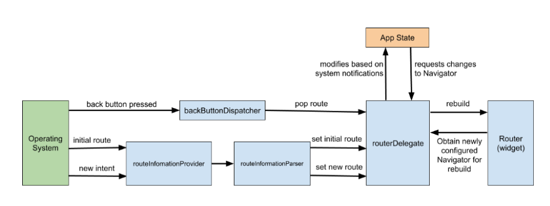

# Flutter navigator 2.0 инструкция

## ВВЕДЕНИЕ

Источник: https://medium.com/flutter/learning-flutters-new-navigation-and-routing-system-7c9068155ade

### Что такой Navigator?

В Flutter есть класс **Navigator**, <u>который является StatefulWidget и очень похож на Stack, но
содержит в себе не Widget, а Page</u>. Когда мы делаем push/pop, то мы вставляем/убираем Page из
стака Navigator. Последний Page будет отображенно на экране.

> ***Navigator - это StatefulWidget, который управляет Stack из объектов Page.***

По дефолту MaterialApp/CupertinoApp под капотом уже имеет один Navigator, и мы получаем доступ к
нему через Navigator.of(). Он упраляет навигацией в приложения, также анимацией переходом и т.д.

#### Параметры Navigator

Navigator имеет такие основные параметры:

1. key (GlobalKey<NavigatorState>) - уникальный индетификатор навигатора. Когда у нас несколько
   навигаторов, то мы можем по ключу обратиться к нужному навигатору.
2. pages - это стопка страниц MaterialPage/CupertinoPage/CustomPage, декларативно описывающих наш
   стек навигации. MaterialPage/CupertinoPage имеют уже готовые настройки анимации перехода между
   страницами по платформам. Также мы можем самим создать свою страницу со своим анимацией переходе,
   наследуя от Page.
3. onPopPage - описывает, что должно произойти, когда мы хотим вернуться назад.

### Что такой Page?

**Page** (страница) - неизменяемый объект, используемый для установки стека истории Navigator. По
сути можно рассматривать как то, что Navigator может показывать пользователу.

### Что такой Router?

**Router** (маршрутизатор) - это виджет, который настраивает список Pages, отображаемых Navigator.
Обычно этот список Pages изменяется в зависимости от базовой платформы или состояния приложения.

### Что такой RouteInformationParser?

**RouteInformationParser** берет RouteInformation из RouteInformationProvider и преобразует его в
определяемый пользователем тип данных. По сути парсит URL и параметры в нем. В основном нужен для
Web, чтобы контролировать переход при изменения URL.

### Что такой RouterDelegate?

**RouterDelegate** - определяет зависящее от приложения поведение, касающееся того, как
маршрутизатор (Router)
узнает об изменениях в состоянии приложения и как он на них реагирует.  
Его задача - прослушивать RouteInformationParser и состояние приложения и билдить на экран Navigator
с текущим списком Pages. Нужен для большего контролля над навигацией.

### Что такой BackButtonDispatcher?

**BackButtonDispatcher** - сообщает Router о нажатии кнопки возврата. Слушает нативную прослойку о
нажатия кнопку назад и потом передает роутеру, где мы можем обработать.

### Как все работает

1) когда оперативная система дает новое событие о новом экране. Например, пользователь перешел на
   именнованую страницу books/2. **RouteInformationParser** Берет данный URL и парсит в Dart тип
   данных.
2) Готовые данные идут к **RouterDelegate**. Он в свою очередь вызывает метод setNewRoutePath,
   который изменяет состояния приложения и там вызывается notifyListeners.
3) **Router** слушает AppState, что там стейт обновился и надо у RouterDelegate вызвать build,
   который вернет новый Navigator с нужной последней странице в его стаке.

## ВЛОЖЕННАЯ НАВИГАЦИЯ

Для вложенной навигации по сути просто создаем еще Navigator в дереве.

1) меняется состояния у делегата
2) отправляется что надо обновить урл у информационного парсера
3) делегат ребилдить Навигатор

